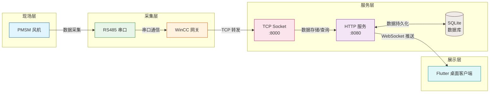

# PMSM风机监测系统

## 项目概述

一套完整的PMSM（永磁同步电机）风机监测解决方案，包含桌面客户端、后端服务和上位机网关软件。系统通过RS485串口通信采集风机运行数据，经网关转发至后端服务器，前端桌面应用实时展示监测数据并支持远程控制。

### 项目框架图



## 技术栈

| 模块 | 技术栈 | 说明 |
|------|--------|------|
| **AppGUI** | Flutter 3.41.0 | Windows桌面客户端，使用Dio HTTP客户端、WebSocket实时通信、EventBus事件总线 |
| **WebServer** | Go 1.26、Gin v1.10.0、SQLite | 后端HTTP服务，使用Swagger生成API文档，SQLite存储数据，Gorilla WebSocket推送实时数据 |
| **WinCC** | C# .NET Framework 4.8 | 上位机网关，RS485串口通信，TCP转发，CRC16校验 |

## 数据库

使用 **SQLite** 作为嵌入式数据库，无需额外安装数据库服务，数据文件默认存储在 `WebServer/data/webserver.db`。

## API接口文档

后端服务使用 **Swagger** 自动生成API文档，启动服务后访问 Swagger UI 查看完整的接口文档。

## 项目结构

```
07_Gin-Flutter-WOL/
├── AppGUI/                    # Flutter桌面客户端
│   ├── lib/
│   │   ├── api/               # HTTP请求、API配置、环境变量
│   │   ├── base/              # 基础数据模型
│   │   ├── components/        # UI组件（Toast、对话框、列表等）
│   │   ├── fan_controllers/   # 风机控制器页面
│   │   ├── more/              # 设置页面、WebSocket
│   │   └── providers/         # 状态管理
│   ├── images/                # 图片资源
│   ├── windows/               # Windows平台配置
│   └── pubspec.yaml
│
├── WebServer/                 # Go后端服务
│   ├── src/
│   │   ├── config/            # 配置加载
│   │   ├── controllers/       # 请求处理、设备管理、协议解析
│   │   ├── httpserver/        # Gin HTTP服务封装
│   │   ├── models/            # 数据模型、数据库操作
│   │   ├── net/               # TCP Socket监听
│   │   ├── routers/           # 路由注册
│   │   └── sysinit/           # 系统初始化
│   ├── conf/                  # 配置文件 (config.conf)
│   ├── data/                  # SQLite数据库文件
│   ├── doc/                   # Swagger API文档
│   └── main.go
│
├── WinCC/                     # C#上位机网关
│   ├── Core/                  # 核心逻辑（网关、串口、TCP客户端）
│   ├── Protocol/              # 通信协议（帧解析、CRC16校验）
│   ├── Utils/                 # 日志工具
│   ├── config.json            # 网关配置文件
│   └── WinCC.csproj
│
├── docs/                      # 项目文档
└── README.md
```

## 快速开始

### AppGUI (Flutter Windows)

```bash
cd AppGUI
flutter pub get
flutter build windows --release
# 输出: build/windows/x64/runner/Release/mywindows.exe
```

### WebServer (Go)

```bash
cd WebServer
go run main.go
# 默认端口: 8080（HTTP），8000（TCP Socket）
# Swagger文档: http://localhost:8080/swagger/index.html
```

配置文件 `conf/config.conf`（首次运行自动生成）：

```json
{
    "WebPort": 8080,
    "SocketPort": 8000,
    "DBPath": "data/webserver.db",
    "FilePath": "upload"
}
```

### WinCC (C#)

```bash
# 使用 Visual Studio 打开 WinCC.slnx 编译运行
# 或命令行指定配置文件：
WinCC.exe -c config.json
```

配置文件 `config.json`：

```json
{
  "serial": { "port": "COM3", "baudRate": 19200 },
  "server": { "ip": "112.74.182.249", "port": 20019 },
  "gateway": { "id": 1, "heartbeatInterval": 15000 },
  "log": { "level": "info", "path": "./logs/gateway.log" }
}
```

## 核心功能

- **风机监控**: 实时监测电压、电流、转速、温度、振动加速度等参数
- **远程控制**: 设置转速、风量等级、运行模式
- **多设备支持**: 支持PMSM10C、PMSM04E、PMSM15、PMSM10A四种机型
- **实时推送**: WebSocket实时推送设备数据变更
- **演示模式**: 无需连接服务器即可演示
- **OTA更新**: 支持应用版本更新

## 演示数据

项目内置演示数据，默认使用演示模式运行：
- 8个风机设备（4种类型各2个）
- 实时监测数据模拟
- 控制参数模拟

## 开发环境

- Flutter SDK 3.41.0
- Go 1.26+
- .NET Framework 4.8
- Visual Studio 2026

## 注意事项

- 国内用户需配置Flutter镜像源
- Windows桌面开发需启用开发者模式
- SQLite数据库文件在首次运行时自动创建
- WinCC网关需要串口硬件支持，无硬件时可使用演示模式
